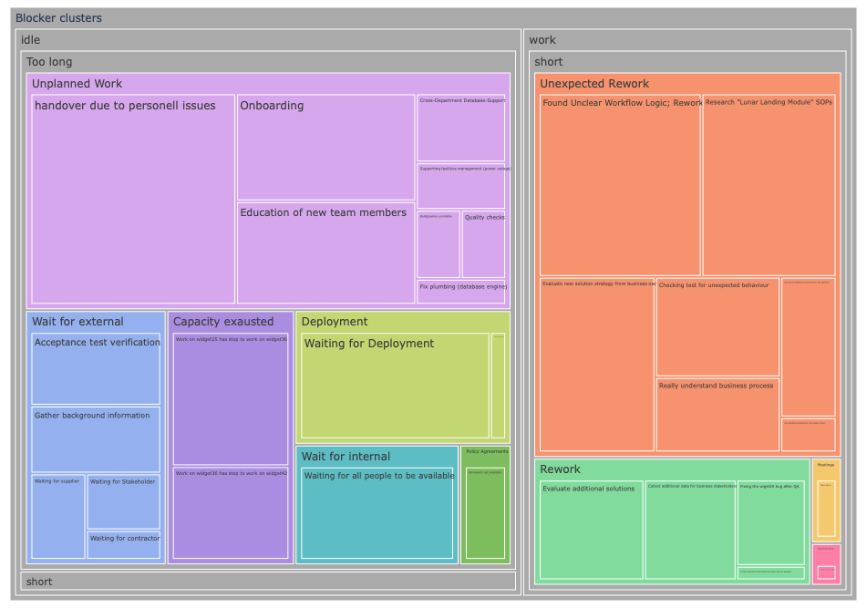

# Blocker Clustering Treemap    

Visualize blockers by impact during [blocker clustering \[1\]](#ref-1).



## GDPR

Note that the `data` directory is excluded from version control for GDPR reasons by means of a `.gitignore` file. This folder is expected to contain the input data.

## Prerequisites

Install the dependencies listed in `requirements.txt`:

```shell
pip install -r requirements.txt
```

## Execute: Visualize Blockers in a Treemap

1. Export your data to `./data/BlockersPrepared.csv`
2. `python3 plotly-blocker-treemap.py data/BlcokersPrepared.csv`

## Backgroud information:
The Code has been almost literally copied from various tutorials or google hits. 

* The Treemap itself is a slightly modified version of the plotly example that can be found when searching for "nested tree map python", namely [Treemap Charts in Python](https://plotly.com/python/treemaps/) (I tried squarify first, but that is way less versatile)
* Colorshemes were a bit harder to find, especially because plotly’s internal search didn’t work at the time of writing this, but an extensive explanation can be found at the [Discrete Colors in Python](https://plotly.com/python/discrete-color/) page.
* The option handling came almost straight from the first result of searching for "command line parameters in python": [Tutorialmoint’s "Python - Command Line Arguments"](https://www.tutorialspoint.com/python/python_command_line_arguments.htm) but those examples are unfortunately not completely correct, so the rest of the information comes from [this tutorial](https://bip.weizmann.ac.il/course/python/PyMOTW/PyMOTW/docs/getopt/index.html)
* The Excel import is described in [the official pandas documentation](https://pandas.pydata.org/docs/reference/api/pandas.read_excel.html) and is the first hit when searching for "pandas read excel"
* [Reading file contents in Python into an array on codegrepper](https://www.codegrepper.com/code-examples/python/how+to+convert+text+file+to+array+in+python) 
* Default arguments from [Default arguments in Python by geeks for geeks](https://www.geeksforgeeks.org/default-arguments-in-python/)

## References
<a name="ref-1">[1]</a> kanbanize.com: [Blocker Clustering](https://kanbanize.com/kanban-resources/kanban-analytics/block-clustering)
